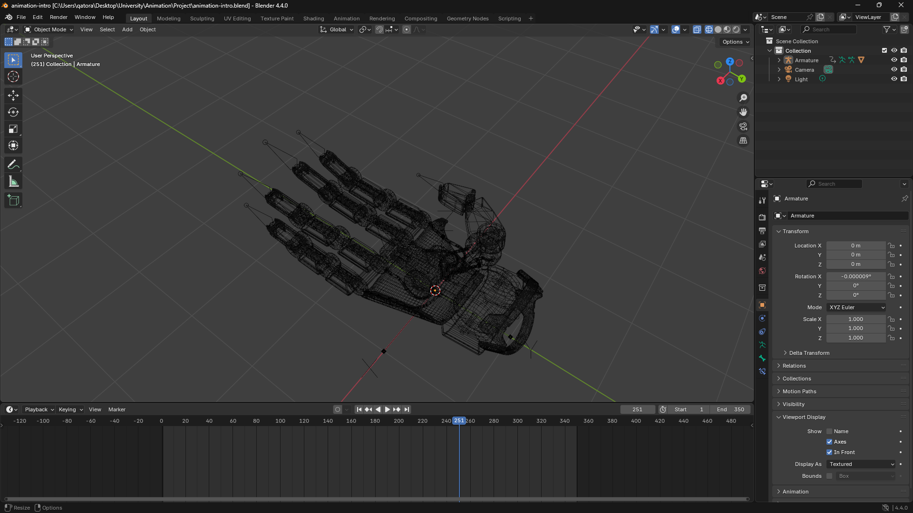
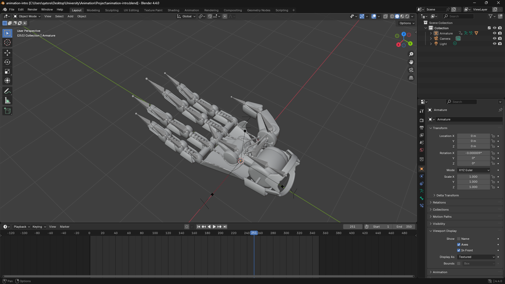
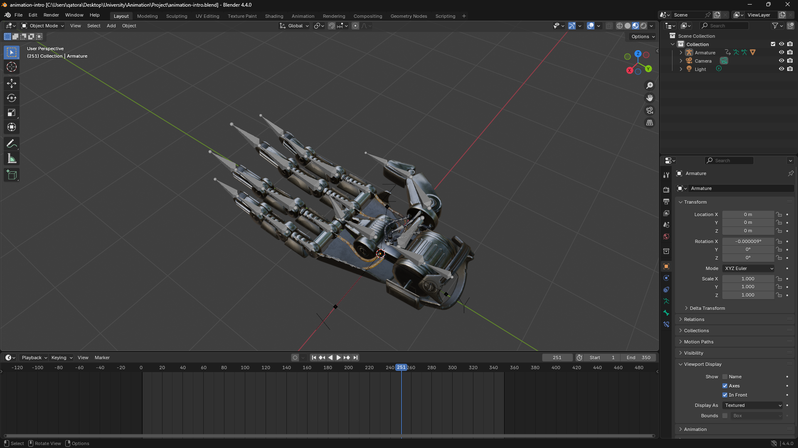
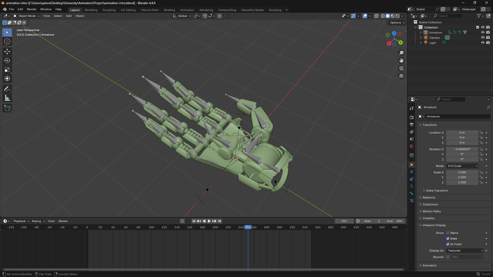
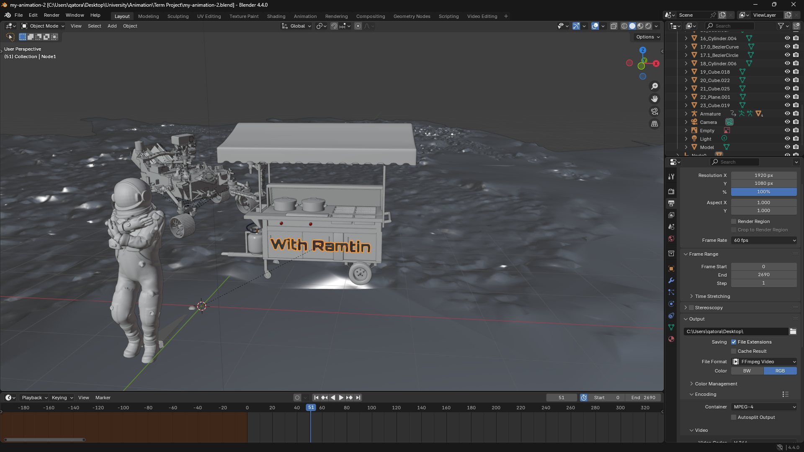
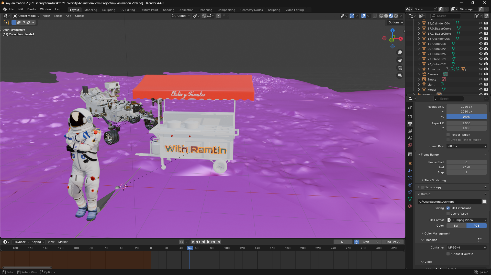
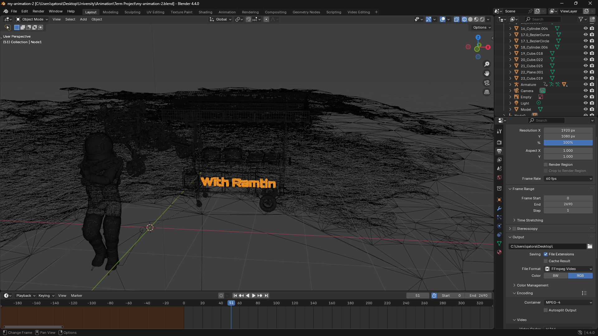

# Fundamental-Animations
Fundamental-Animations Presentations, Tutorials and Project

## Courses Info
- Teacher : Dr. Sadegh Kord Afshar
- Score : 20 / 20
- Semester : 8

## Projects Images
#### 1. Teaching Project

  
  
  
  

#### 2. Main Project (Video Available [Here](./Assets/1.mp4))

  
  
  
  

#### 3. Presentation (Video Available [Here](./Assets/2.mp4))
