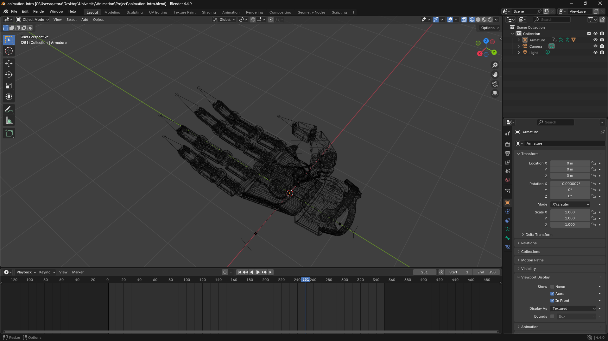
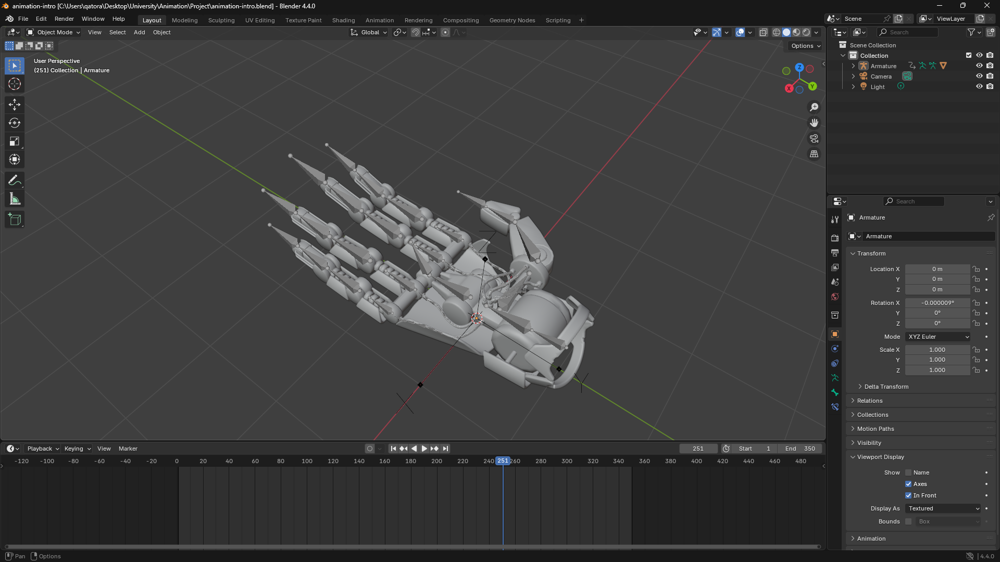
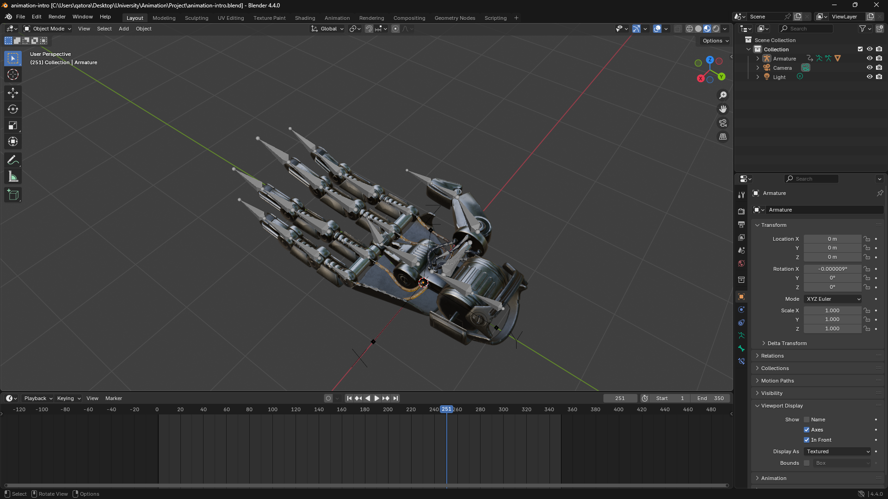
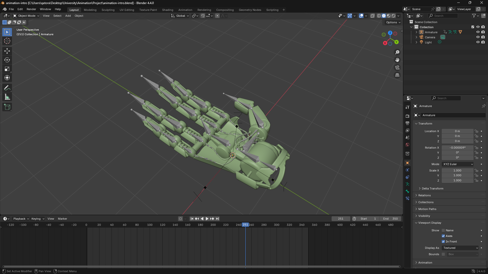
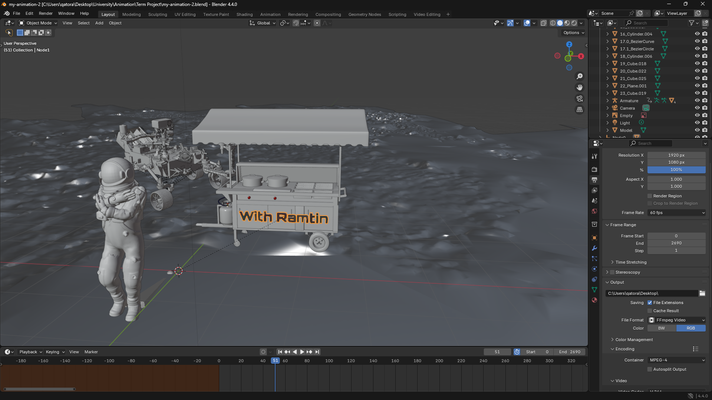
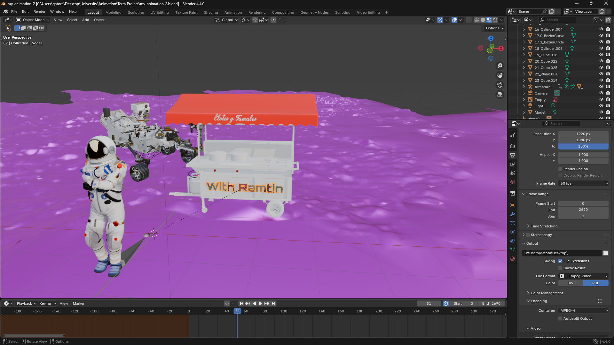
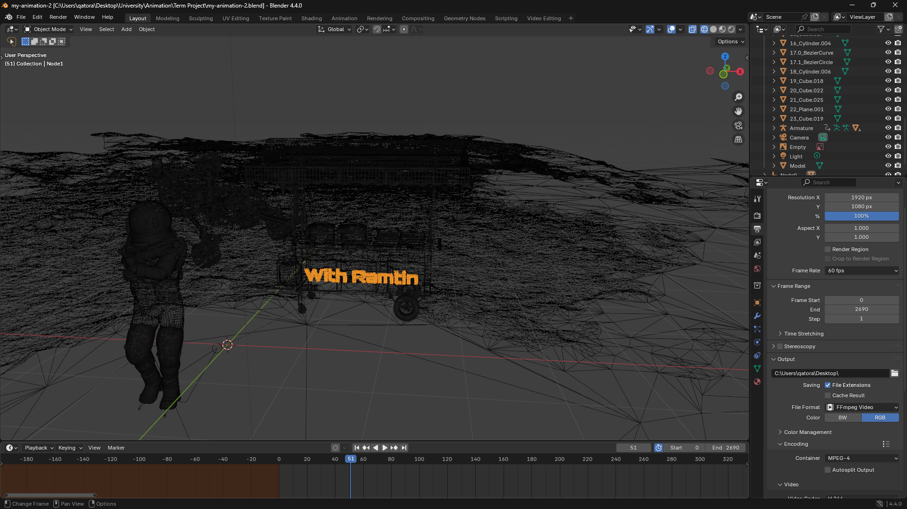
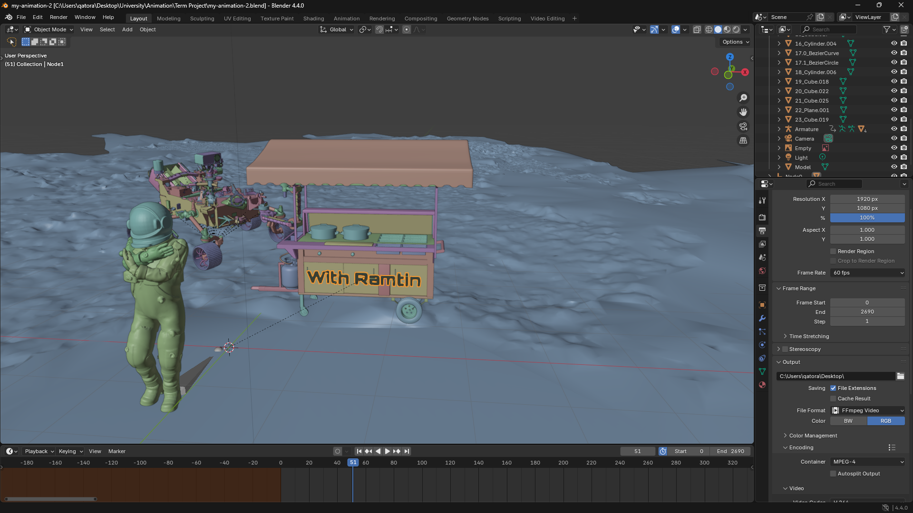

# Fundamental-Animations
Fundamental-Animations Presentations, Tutorials and Project

## Courses Info
- Teacher : Dr. Sadegh Kord Afshar
- Score : 20 / 20
- Semester : 8

## Projects Images
#### 1. Teaching Project

  
  
  
  

#### 2. Main Project (Video Available [Here](./Assets/1.mp4))
https://github.com/user-attachments/assets/04a5e2b9-ec5e-40c6-9b18-e897a043af08

  
  
  
  

#### 3. Presentation (Video Available [Here](./Assets/2.mp4))
https://github.com/user-attachments/assets/3fc8eff9-d39a-493b-a4a4-1bf7eb068966
